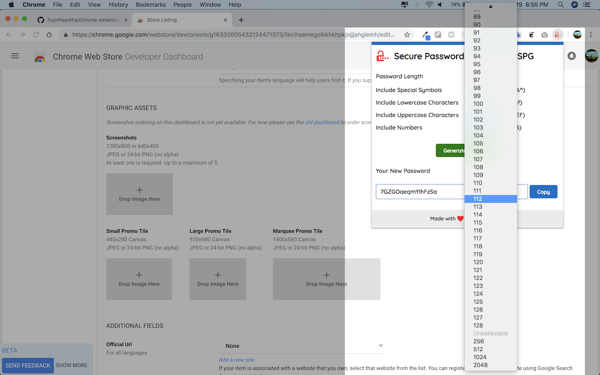
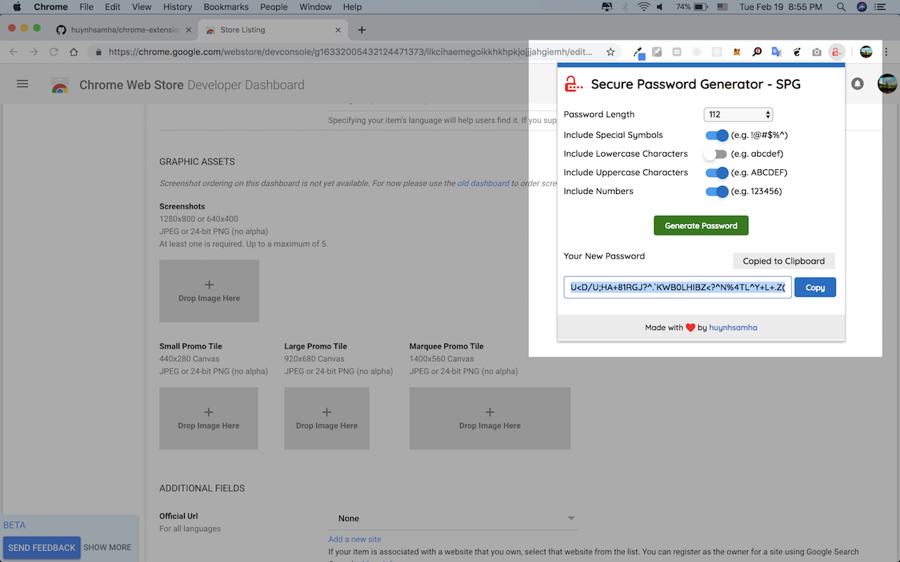

# browser-extension-spg

Chrome Extension and Firefox Add-on - Secure Password Generator (SPG)

Firefox Add-on is available here https://addons.mozilla.org/en-US/firefox/addon/secure-password-generator-spg/

Available demo on web version: https://huynhsamha.github.io/chrome-extension-spg/

### Install extension on Chrome browser
+ Clone or download this reposiory to your local machine
+ Open link **[chrome://extensions](chrome://extensions)**
+ Turn on the **Developer Mode**
+ Click to **Load unpacked** and browse to folder **build** in this repository
+ Now, extension is installed on browser locally (only for developer mode)

### Install Add-on on Firefox
Open https://addons.mozilla.org/en-US/firefox/addon/secure-password-generator-spg/ and install Add-on on your Firefox browser - very simple.

### Screenshots
#### On Chrome

#### On Firefox

