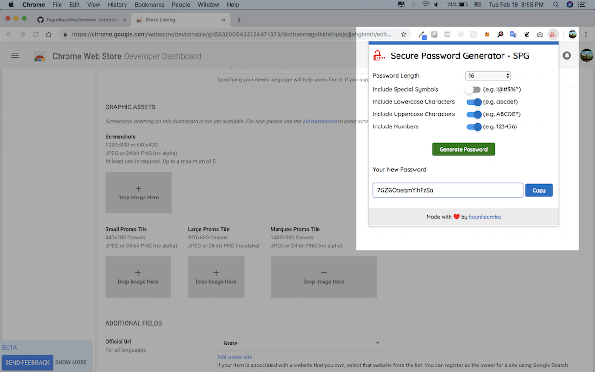

# chrome-extension-spg

Chrome Extension - Secure Password Generator (SPG)

Available demo on web version: https://huynhsamha.github.io/chrome-extension-spg/

### Install extension on Chrome browser
+ Clone or download this reposiory to your local machine
+ Open link [chrome://extensions](chrome://extensions)
+ Turn on the **Developer Mode**
+ Click to **Load unpacked** and browse to folder **build** in this repository
+ Now, extension is installed on browser locally (only for developer mode)

### Screenshots

